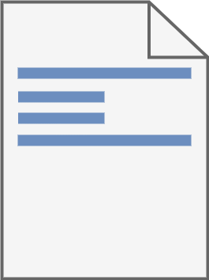
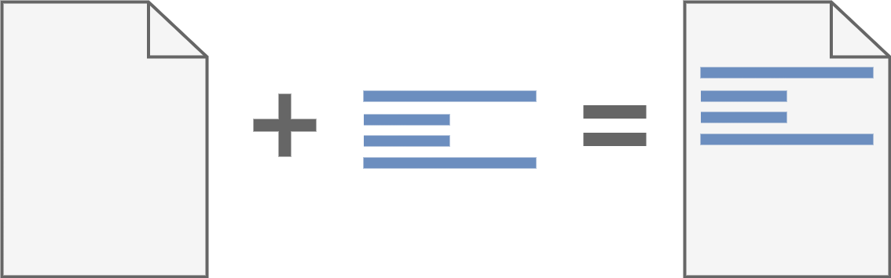
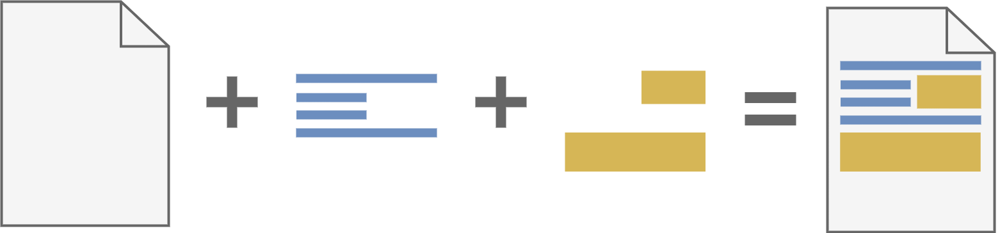
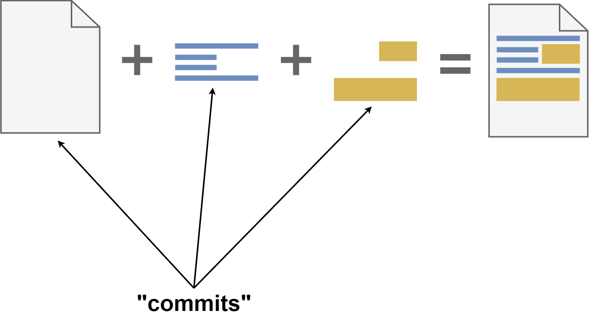
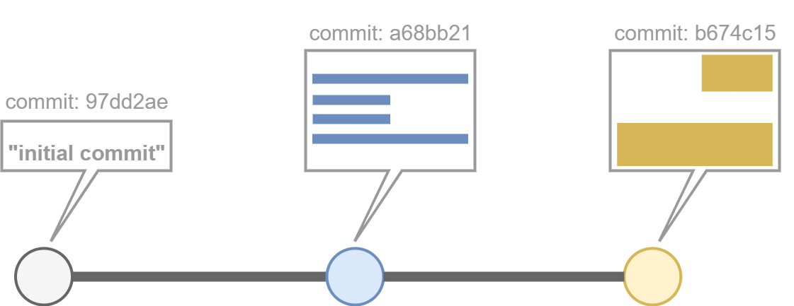
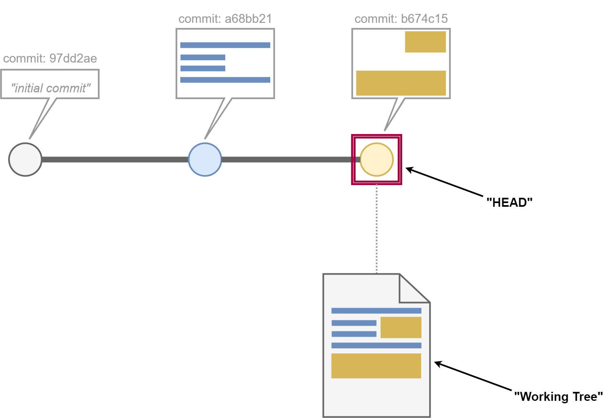
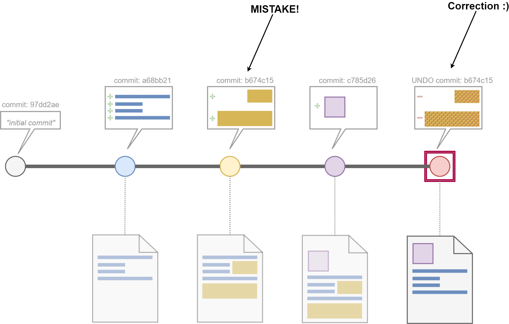
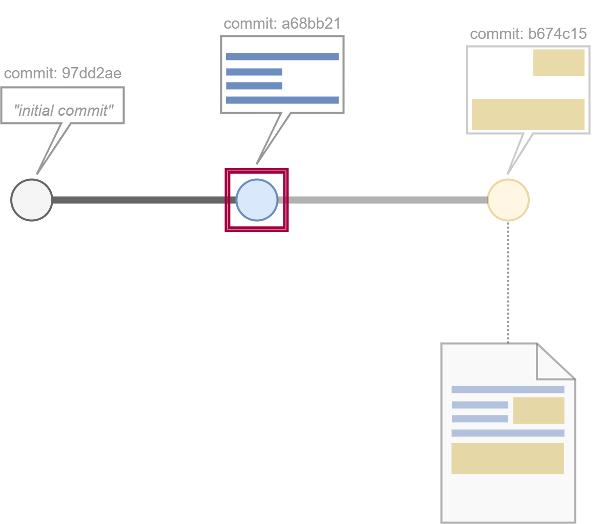
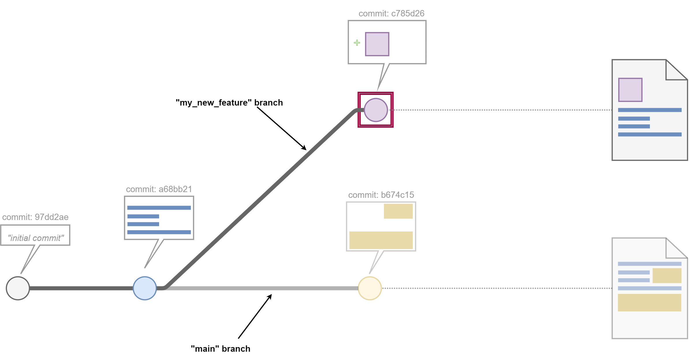
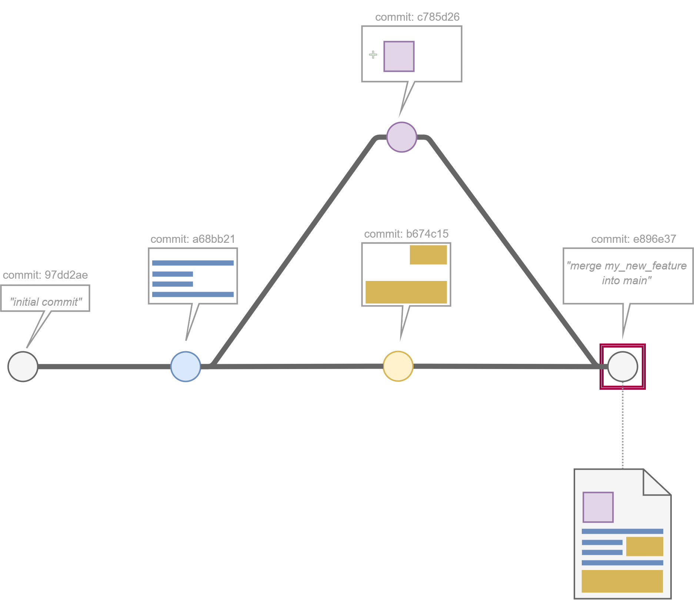

# What Is Git?

## Introduction

## Humble Beginnings - A Blank File

## Making A Change

## A Change Is A Difference

## One Thing After Another

## Commitment 

## A Simpler Representation

## Use Your HEAD

## Reversing Mistakes

## Travelling To The Past

## The Garden Of Branching Paths

## Histories Merged
