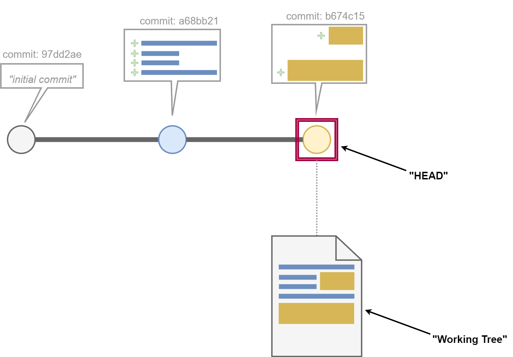
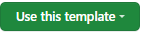

<h1> Git and GitHub </h1>

This lesson is a practical introduction to using Git and GitHub. Your mentors will explain these tools in class before you begin this walkthrough. Don't worry if the explanation hasn't clicked yet by the time you begin this practical component - Git is one of those tools that can be tricky to understand until you get your hands dirty.  

Even if you're still feeling confused by the end of class, don't fret - the best way to get comfortable with these skills is to practise them, and there'll be plenty of opportunity for that throughout this course!

<h2>Table of Contents</h2>

- [Section 1: Git](#--section-1-git)
  - [1.1 🧹 Some Housekeeping 🧹](#11--some-housekeeping-)
  - [1.2 🌄 Initialisation 🌄](#12--initialisation-)
  - [1.3 🌱 The Initial Commit 🌱](#13--the-initial-commit-)
  - [1.4 🪴 A Second Commit 🪴](#14--a-second-commit-)
  - [1.5 ⏳ A Pause To Take Stock ⏳](#15--a-pause-to-take-stock-)
  - [1.6 🌵 Create A Feature Branch 🌵](#16--create-a-feature-branch-)
  - [1.7 🛠️ Develop A Feature 🛠️](#17-️-develop-a-feature-️)
  - [1.8 ⏳ Pause Again: What Did We Just Do? ⏳](#18--pause-again-what-did-we-just-do-)
  - [1.9 ⛙ Merge The Feature Branch Into Main ⛙](#19--merge-the-feature-branch-into-main-)
  - [1.10 ⏳ Pause Pt. 3: The Pausening ⏳](#110--pause-pt-3-the-pausening-)
- [Section 2: GitHub](#-section-2-github)
  - [2.1 ⏫ Uploading A Repo ⏫](#21--uploading-a-repo-)
  - [2.2 ⏳ Pause: Did It Work? ⏳](#22--pause-did-it-work-)
  - [2.3 ⏬ "Cloning Down" A Repo ⏬](#23--cloning-down-a-repo-)
- [Section 3: Normal Git Practises](#section-3-normal-git-practises)
- [Section 4: Exercises](#section-4-exercises)
  - [4.1 💪 Add some more code to your `git_and_github/` repo! 💪](#41--add-some-more-code-to-your-git_and_github-repo-)
  - [4.2 💪 Check That Your Portfolio Page Is Up! 💪](#42--check-that-your-portfolio-page-is-up-)

---
---
---

##   Section 1: Git
Git is a "version control" tool. This means we can use it to keep track of and manage changes that we make to our code. 

Git lets us safely try out modifications to code, without losing the version that works. It also allows us to "stitch together" all the best bits from various versions of our software. 

This might sound a bit abstract, so let's work through an example together.

---
---

### 1.1 🧹 Some Housekeeping 🧹
If you followed the instructions in our first ever lesson to the letter, you will have created a conveniently-located folder to hold your classwork. Let's check that it exists now:

---

#### Step 1.1.1 🏡 Go To Your Home Directory 🏡

Open the terminal, and issue the following command:

```bash
cd ~
```

> [!NOTE]\
> That squiggly line is called a "tilde" (pronounced "til-duh"). You can type it by holding `Shift`, and then pressing the button next to the number 1 at the top of your keyboard.

This command navigates you to your "home" directory. That's the directory set aside for your personal files and folders.

---

#### Step 1.1.2 🎓 Make Sure You Have A Directory For Your Class Work 🎓

Enter this command:

```bash
ls
```

This will print the contents of your home directory on the screen. You should see a directory listed among them called `she_codes/`. 

> [!IMPORTANT]\
> If you don't see one, you can create it now with:
>
> ```bash
> mkdir she_codes
> ```

---

#### Step 1.1.3 🧭 Navigate Into Your Class Work Directory 🧭

Now that we're certain that your `she_codes` directory exists, navigate into it with this command:

```bash
cd she_codes
```

---
#### Step 1.1.4 📁 Create A Directory For Today's Work 📁

We need a directory to hold our work for this lesson. You can create one and simultaneously navigate into it by entering the following command:

```bash
mkdir git_and_github && cd $_
```

> [!NOTE]\
> `$_` is a little trick to let us avoid typing `git_and_github` twice. It is like saying "use that last value that I gave you again" to the shell. 
> 
> So this command says: "create a directory called `git_and_github`, and then immediately change directory into that same folder".

You should now be here:
```
~/
|
├─ she_codes/
| |
| ├─git_and_github/   <--- You are here
```

Ok, we are now ready to begin! What we just did is a good way to begin any class where we work on a new project. Jump to your classword directory, and then make a new folder to hold the code for that project.

---
---

### 1.2 🌄 Initialisation 🌄

We are going to turn our `git_and_github/` directory into a "Git Repository". That's what we call a directory that is version controlled with Git. 

This is another good thing to do each time we start work on something new.

---

#### Step 1.2.1 🗂️ Initialise The Directory As A Git Repo 🗂️
Run the following command:

```bash
git init
```

This "initialises" the folder as a Git repo. 

---

#### Step 1.2.2 👀 Inspecting Our New Git Repo 👀
This step isn't required every time you initialise a new repo, but it's useful this time just to see what that command did. Let's look at the contents of our new repo with this command:

```bash
ls -A
```

> [!NOTE]\
> The `-A` there is a "flag". It adds optional extra functionality to the command. In this case, we are asking the shell to list ALL of the contents of the current directory, including hidden files and folders.

Here's what you should see:


Hidden files and directories have names that begin with a dot. We can see that Git has created a hidden directory for us called `.git/`. This directory stores all the files that Git uses for keeping track of changes to our files. We don't need to open it right now - Git will handle it for us.

> [!CAUTION]\
> We **won't** be working *inside* the `.git/` directory. It is just there to let Git do its thing. We will be creating all of the files and folders we need inside the `git_and_github/` directory, and `.git/` will just sit there alongside them. Watching. Waiting. 👀👀👀

> [!WARNING]\
> Try to avoid a situation where one Git repo gets created *inside another one*. This can cause some very weird and confusing problems. 
>
> **Correct Structure:**  
> In general, you want to keep all the files for each project inside one "umbrella" directory, and make that umbrella directory your git repo. When you start a new project, make a new umbrella directory for it, next to your other projects. Like this:
>
> ```
> she_codes/
> ├─ html_intro/
> │  ├─ index.html
> │  ├─ styles.css
> |
> ├─ git_and_github/        <--- This is a git repo!
> │  ├─ README.md
> │  ├─ .git/
> |
> ├─ profile_site_project/  <--- This is a git repo!
> │  ├─ index.html
> │  ├─ styles.css
> │  ├─ README.md
> │  ├─ .git/
> ```

---
---

### 1.3 🌱 The Initial Commit 🌱
Git handles changes that we make to our files by storing them in "commits". Each commit represents a set of changes - a bit like a snapshot of our progress. 

We need to create an initial commit, so that we have a "starting point" to build on for our future changes. 

---

#### Step 1.3.1 📄 Create A Blank File 📄

Let's create a blank file to be in our initial commit. Run the following command:

```bash
touch README.md
```

> [!NOTE]\
> The `touch` command creates a new file with the name supplied.

Now open the current directory in VS Code like so:

```bash
code .
```

Here's what you should see:


---

#### Step 1.3.2 🕵️ Check The Status 🕵️
We won't be adding any code yet - we'll let our initial commit just contain a blank file. Jump back into the terminal and run the following command:

```bash
git status
```

Here's what you should see:


So, Git can see that we have created a new file in the repository, but it isn't yet keeping track of those changes. If we want to add them to a commit, we need to put them in Git's "staging area". This is a holding zone for the changes we add to our commits.

---

#### Step 1.3.3 📥 Add The New File To The "Staging Area" 📥

To stage changes to a file, we use the `git add` command. Give it a go:

```bash
git add README.md
```

Now try checking the status again:

```bash
git status
```


Looking good!

---

#### Step 1.3.4 💾 Make The Commit 💾
We are now ready to make our first commit! Here's the command:

```bash
git commit -m "initial commit"
```

> [!NOTE]\
> The `-m` flag lets us add a "commit message" - a little explanation of what changes are in this commit. The text inside the quotation marks is the message. It's important to supply a message every time - Git will make your life difficult if you don't.

Here's the result of running that command:


Nice! We have a blank canvas to build on now. 

---
---

### 1.4 🪴 A Second Commit 🪴
Let's make a real change now!

---

#### Step 1.4.1 📝 Adding Some Code 📝

Go back to VS Code, add some text to `README.md`, and save the file. Here's a suggestion for what you can add:

```md
# Git Demonstration
Here are some useful commands for Git:
* `git init`: initialises a directory as a Git repo
* `git status`: checks the status of a Git repo
* `git add some_file_name`: adds `some_file_name` to staging
* `git commit -m "some message"`: creates a Git commit with "some message" as the commit message 
```

Don't forget to save the file!

> [!NOTE]\
> The code we have added is in a language called "Markdown". It's quite extremely useful, and we will see it again in this course. Luckily, Markdown is so close to normal English that we don't need to be familiar with it to understand what's being said here.

---

#### Step 1.4.1 🕵️ Check The Status Again 🕵️
Let's check the status again! 

```bash
git status
```


Our new changes have been noticed by Git, but once again they aren't automatically staged. This is good, because sometimes there will be new changes that we don't want to add to our next commit! In this case, though, we **do** want to include this change in our next commit, so...

---

#### Step 1.4.2 📥 Add To Staging Again 📥
Add that change to staging! Same command as before:

```bash
git add README.md
```

Just to prove that it worked, let's check the status again. You don't need to do this every time, but it's a good demonstration for now:

```bash
git status
```


Note that before our staged changes were marked with `new file:`, whereas now they register as `modified:`. Git is savvy!

---

#### Step 1.4.3 💾 Make That Commit! 💾
Ok, let's make our second commit. This time we need to include a different message:

```bash
git commit -m "added some useful hints on how to use Git to the README"
```


---
---

### 1.5 ⏳ A Pause To Take Stock ⏳
Let's just take a moment to discuss the structure of Git repos. 

Often when we discuss Git we depict our repositories with pretty diagrams like this:


> This diagram shows a repo with three commits (one more that we've made so far in this exercise!) We can see:
> - an initial commit
> - a commit where some text was added to a file
> - a commit where some images were embedded in the text
>
> Note that instead of commit messages here, we have a graphical depiction of the file. This isn't something we'd see in the real world, but it's handy to understand what is happening when we make those commits!

> [!IMPORTANT]\
> The above graph has two important pieces of nomenclature in it: **HEAD**, and **Working Tree**.
> - The `HEAD` is the name we give to "the commit we are working from right now". Often that will be the most recent commit, but one of Git's superpowers is that we can "turn back time" by shifting the `HEAD` to any previous commit. That lets us look at our files as they were in the past, and even experiment by making different changes in an "alternate timeline". This is incredibly useful for correcting errors! 
> - The "working tree" is just Git's name for "all of the commits up to and including the `HEAD`". In other words, it is the "current state" of our repo - what you'll see if you open the repo in VS Code. Note that if we move the `HEAD` to a previous commit, then the working tree will change back to how it looked in the past! This means the files in VS Code will revert!

So what does our actual repo look like?

When we are actually working in the terminal, we can't get quite such a pretty representation. But we can get close! Try running this command to get a depiction of our work so far:

```bash
git log --graph
```

Here's what I see:


This is pretty much what we had above - it has just been rotated by 90 degrees, and rendered as text-art. The initial commit is at the bottom, and our second commit is above it. Each commit is represented by an asterisk. 

Of course, the working tree isn't represented in our command line graph. But the working tree is just "the current state of our code", and we can see that by looking at the files in VS Code!

Not bad!

> [!NOTE]\
> We mentioned above that Git can be used to revert a previous mistake. We won't be demonstrating that here, because we don't want to get bogged down. If you run into trouble on a project, grab a mentor and ask them how to do a "revert"!

---
---

### 1.6 🌵 Create A Feature Branch 🌵
We've got some good progress in our repo here. We'd like to add some more, but we don't want to risk breaking what we already have by adding untested new code.

As we hinted above, it's possible to split off an "alternate timeline" with Git where we commit experimental changes. This is called "branching". By default we are working on the `main` branch, but we can create a new one any time we want.

Let's create a new branch to hold our new changes. Once we are happy with them, we can "merge" them into the `main` branch, making them official.

A branch that we create to add new content or functionality to our code is called a "feature branch". In this case the feature that we're adding will just be more text in the `README.md` file, but that's ok! From little things, big things grow.

---

#### Step 1.6.1 🌱 Create The New Branch 🌱

Run the following command in the terminal:

```bash
git branch my_new_branch
```

> [!NOTE]\
> Here `my_new_branch` is the name we are giving to our new branch!

---

#### Step 1.6.2 🕵️ Take A Look At The Current Branches 🕵️

Just so we are orientated, let's see what branches we have right now. To do this, you can run this command:

```bash
git branch
```

Since we didn't supply the name of a new branch, Git will just list all the currently available branches for us.


The asterisk here indicates that we are currently operating on the `main` branch. If we want to work on our new feature in the other branch, we'll need to change that...

---

#### Step 1.6.3 ➡️ Check Out The New Branch ➡️

When we swap to a different branch in Git, we call it "checking out" the branch. We can do it with the following command:

```bash
git checkout my_new_branch
```

---
---

### 1.7 🛠️ Develop A Feature 🛠️
We created this branch to introduce new code into the repo, so let's do it!

---

#### Step 1.7.1 📝 Write The Code 📝
Hop back over to VS Code. You should see the same contents in the `README.md` file as you did before, since right now our two branches are identical to one another. 

Let's change that. Here's a modification to make to the file:

```diff
# Git Demonstration
Here are some useful commands for Git:
* `git init`: initialises a directory as a Git repo
* `git status`: checks the status of a Git repo
* `git add some_file_name`: adds `some_file_name` to staging
* `git commit -m "some message"`: creates a Git commit with "some message" as the commit message 

+ Some more commands:
+ * `git log --graph`: displays a graph of the commits in your repo
+ * `git branch`: lists the current branches in your repo
+ * `git branch some_branch_name`: creates a new branch called "some_branch_name"
+ * `git checkout some_branch_name`: moves the HEAD to the most recent commit on the branch called "some_branch_name"
```

Make sure you save your work!

---

#### Step 1.7.2 📥 Stage The Changes 📥

You can use `git status` to check what files have changed if you'd like. That's a good idea when you've made complex changes or it has been a while since your last commit.

In this case, though, we know exactly what has changed, and there's only one file we need to stage. So let's run that command:

```bash
git add README.md
```

---

#### Step 1.7.3 💾 Make The Commit 💾

This should be getting familiar! Here's that command again, this time with a different commit message:

```bash
git commit -m "added some extra examples of git commands to the readme"
```

---
---

### 1.8 ⏳ Pause Again: What Did We Just Do? ⏳

We just branched off an "alternate timeline" from our main branch, and added a commit to it. That means that we have two possible states for our repository, and we can flip back and forth between them by swapping branches.

> [!TIP]\
> You could give that a go now - it's a good way to get an intuitive idea of what branches do. You can use `git checkout main` to jump to your main branch, and `git checkout my_new_branch` to jump back to our feature branch. Take a look at the `README.md` file in each branch - see how the new content we added is only present in the feature branch?

The state of our repo now looks something like this:


> [!NOTE]\
> We're showing it to you in this format because the Git log graph doesn't draw lines where there are no commits. So it won't show you the forking path, since the `main` branch hasn't has any commits after the one marked with a blue circle here.
>
> You can still take a look at the Git graph, it'll just be a bit less helpful.

---
---

### 1.9 ⛙ Merge The Feature Branch Into Main ⛙
It's go time! Our "feature" is complete, and we are happy with how it looks, so let's merge it into the "canonical" version of our code - the `main` branch.

---

#### Step 1.9.1 ⬅️ Check Out The Main Branch ⬅️

To start with, we have to jump back to the `main` branch, since we want to merge our changes into it. 

You can do that with this command:

```bash
git checkout main
```

> [!IMPORTANT]\
> The branch we are **in** is always the branch that will have changes applied to it in a merge. So, since we want to add the changes *from* `my_new_branch` *to* `main`, we needed to "check out" the main branch before merging!

---

#### Step 1.9.2 ⛙ Merge Away! ⛙
Ok, time to merge. Here's the command for that:

```bash
git merge my_new_branch
```

Here's what you should see:


---
---

### 1.10 ⏳ Pause Pt. 3: The Pausening ⏳

Where are we now? What have we done so far?

1. We had some code on our main branch.
1. We split off a feature branch to test some new code.
1. We liked our new code, so we merged it into the main version.

Here's a diagram representing where we are at:


> [!NOTE]\
> As before, you can take a look in the Git log, but since it doesn't draw lines that con't have commits in them, the bottom path between our blue commit and the merge won't appear.

This is great. But right now, all of the code is stored on your computer. What happens if you drop your laptop off a bridge? And if someone else wants to contribute to your work, how can they send you their additions?

For that we'll need something extra...

---
---
---

##  Section 2: GitHub

GitHub is a cloud-based version control tool. It combines with Git to give you super-powered control over your code, from anywhere on the planet.

With GitHub, you can upload your Git repositories to the internet, share them with whomever you want, and choose who is allowed to make changes to them.

Today we will just cover the basics, but later on down the line we will come back and expand our powers.

---
---

### 2.1 ⏫ Uploading A Repo ⏫

Right now we have a repository on our machine that we want to get onto GitHub. We'll look at how to do that first. Then later on we will show you how to get a repo from GitHub onto your local machine.

---

#### Step 2.1.1 🌤️ Create A Repo In The Cloud 🌤️
Head to [GitHub](https://github.com/). You may need to log into your account for this.

> [!IMPORTANT]\
> If you haven't set one a GitHub account yet, now is the time! Then, after class you should check the [student handbook]() for information on how to get set up with a GitHub Student account. You'll need one later in the course!

Oh the main homepage you'll find a `New` button in the left hand pane like so:


Give it a click, and assign your repository a useful name. I recommend `"intro_to_git"`. 

> [!CAUTION]\
> You can add a description if you want, but you should leave the rest of the form blank for now. We will be uploading content from our computer, so we don't want to block it with autogenerated content from GitHub.

Here's how your form should look when you submit it:


```diff
- Need to add a link to the student handbook in the section above when it's complete
```

---

#### Step 2.1.2 📋 Copy The Address For Your Cloud Repo 📋

Clicking the `Create Repository` button should redirect you to your new repo. It will be empty for now, so you'll just see a screen with some `"Quick Setup"` tips.

Near the top of the page is a link you can copy. Grab it now - we are about to need it.


---

#### Step 2.1.3 🔗 Link Your Local Repo To The Remote 🔗
The git repository you have on your local machine is called your **"local"** repo. The one on GitHub is called the **"remote"** repo.

We want to establish a link between them so that we can sync up the changes between them.

Jump into the terminal again, and run the following command, pasting the link you just copied from GitHub in the relevant spot:

```bash
git remote add origin YOUR_PASTED_LINK_HERE
```

This establishes the link between the repositories. Your local repo now knows that there is a repository on GitHub to match it. 

> [!NOTE]\
> We told Git that the remote repo should be labelled `"origin"` here because that's considered normal practise, but technically you could call it anything. You'd just need to swap the new name into the command. 
> 
> Most of the time `"origin"` is the right choice unless you're doing something complicated.

---

#### Step 2.1.4 ⬆️ "Push" Your Changes To The Remote ⬆️
Let's send all our changes up to GitHub, so that it contains a backup of all the work we've done so far. 

The command for that is easy:

```bash
git push origin main
```

> [!NOTE]\
> We specify `main` here, because we are pushing just the main branch. We could push a different branch if we wanted, but we don't have any other branches we care about right now. 
>
> We've also named the remote repo we are pushing to - as expected, it's `origin`!

---
---

### 2.2 ⏳ Pause: Did It Work? ⏳
Refresh the browser page on GitHub. You should see the readme file that you wrote locally.

You'll note that the Markdown code we created has been tastefully rendered. Nifty!


Under the green `<> Code` button, you can see that we've made three commits on this file. (In my case, I made them last week, because I've been working on this lesson for a little while.) 

We can also see from the top left that we are on the `main` branch, and that only one branch has been pushed to this remote repo so far.

If there were more files in the repo we would be able to explore them too, but let's keep things simple for now.

---
---

### 2.3 ⏬ "Cloning Down" A Repo ⏬
Now that we've covered the case where you created the repo on your home machine and needed to back it up on GitHub, let's cover the other alternative.

What if you have a repo on GitHub that you want to copy down onto your local machine? 

Luckily, it's quite easy.

---

#### Step 2.3.1 🌱 Create The Repo 🌱
If you're going to download a remote repo from GitHub, we need to have a remote repo on your GitHub profile that doesn't already exists on your local machine. After all, there's no sense downloading something you already have - it would be confusing to have *two*!

Good news: I have just the repo. [Here is a template for your first project submission!](https://github.com/SheCodesAus/plus-portfolio-project-template)

Click the `Use this template` button near the top of the page, and select `Create a new repository`. 



> [!IMPORTANT]\
> Since we are creating your personal portfolio, There are two crucial settings for this repo:
> 1. **You need to give your repo a very specific name.** It should be `your_username.github.io`, where `your_username` is replaced by whatever your GitHub username is.
> 
>     For example, my username is `Hauteclere`. So I would call my repo `hauteclere.github.io`.
> 
> 2.  **You need to select the `Public` visibility option.** If you create a private repo, nobody will be able to see your site!

---

#### Step 2.3.2 📋 Copy The Repo Address 📋
Just as before, you should be redirected to the repo page for your new repo, only this time you'll see the starter files we supplied with the template.

Click the `<> Code` button to copy the repo address!

---

#### Step 2.3.3 🧭 Navigate Into Your Class Work Directory 🧭
Jump into your terminal and issue the following command to move back into the repo where all your class work is stored:

```bash
cd ~/she_codes
```

You should now be here:
```
~/
|
├─ she_codes/  <--- You are here
| |
| ├─git_and_github/   
```

---

#### Step 2.3.4 🧑‍🤝‍🧑 Clone The Repo 🧑‍🤝‍🧑
We want to tell Git to go look up your portfolio project directory on GitHub and download it to your laptop. Here's the command:

```bash
git clone YOUR_LINK_HERE
```

Note that you need to swap in the link you copied in place of `YOUR_LINK_HERE`!

---

#### Step 2.3.5 🕵️ Look At The Result 🕵️
Run the following command:

```bash
ls
```

You should see your portpolio repo listed in the results!

> [!NOTE]\
> When you "clone down" a repo like this, it arrives fully initialised and ready to go. You can get started right away on making branches and committing changes!

---
---
---

## Section 3: Normal Git Practises
Great news! What we've covered so far is enough for you to conduct normal operations with Git. 

> **❓ QUESTION ❓**\
> *Should I create repositories locally and then push them to the cloud, or is it better to create a repo on GitHub first and then clone it down?*

Either method is fine! If you already have some code locally, you'll need to go with the `push` option. If there's already code on GitHub that you don't have locally, then you'll need `clone`. But if you're starting from scratch, the choice is yours!

> **❓ QUESTION ❓**\
> *So how should you work on a project? What does day-to-day workflow look like once you've got a repo set up?*

Here's a normal workflow. 
1. Make a new branch to experiment with changes on.
2. Make incremental commits on the branch until you've completed the modification you set out to make. 
3. Merge the feature branch into `main` once you're satisfied.
4. Push your branches to GitHub often, to make sure they're backed up.
5. Once one feature is completed, start work on a new one!

> [!TIP]\
> We operate this way because it ensures that the `main` branch is always correct and working. We never end up in a situation where our main version of our code has errors in it, because we always fix errors before we merge them into `main`! 
> 
> When you first begin a project it can be tempting to commit straight to main, just to get a few runs on the board. That's fine, since there's nothing to break at that stage. But once you have something functional, you should make sure to use a feature branch when you're working on a new chunk of code.

> **❓ QUESTION ❓**\
> *What if I run into problems?*

It's common to make mistakes when you're first starting out. The good news is that Git makes it hard to accidentally destroy your work. The kinds of problems you're likely to encounter are called "merge conflicts", and when those crop up you should grab a mentor and get troubleshooting!

---
---
---

## Section 4: Exercises

### 4.1 💪 Add some more code to your `git_and_github/` repo! 💪
We've gone through a few more useful commands since the last commit there. Make a **new feature branch** and add some code to the `README.md` file containing definitions for the commands below. Then **stage** and **commit** the changes, **merge** the branch, and **push** to GitHub! 

- `git remote add origin YOUR_PASTED_LINK_HERE`
- `git push origin main`
- `git clone YOUR_LINK_HERE`

Add in any other tips you think would be helpful to have jotted down, too!

---
---

### 4.2 💪 Check That Your Portfolio Page Is Up! 💪
Because we gave the repo for your portfolio project that special name, it should have been deployed as a website automatically.

You can check by going to:

`https://YOUR_USERNAME_HERE.github.io/`

(Just substitute in your actual GitHub username in the appropriate spot.)

Try making a feature branch to add some text to the `index.html` file, before committing, merging, and pushing. Then go back to your portfolio page and refresh - hopefully the text should appear!
