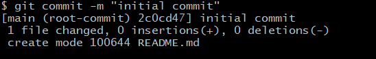

#  Git and Github 
This lesson walks you through the basics of what Git is and how to use it. Once we've covered that, we will take a look at Github as well!

- [ Git and Github ](#-git-and-github-)
  - [1.0 - Git](#10---git)
    - [1.1 - Some Housekeeping](#11---some-housekeeping)
      - [1.1.1 - Go To Your Home Directory](#111---go-to-your-home-directory)
      - [1.1.2 - Make Sure You Have A Classwork Directory](#112---make-sure-you-have-a-classwork-directory)
      - [1.1.3 - Navigate Into Your Classwork Directory](#113---navigate-into-your-classwork-directory)
      - [1.1.4 - Create A Directory For Today's Work](#114---create-a-directory-for-todays-work)
    - [1.2 - Initialisation](#12---initialisation)
    - [1.3 - The Initial Commit](#13---the-initial-commit)
      - [1.3.1 - Create A Blank File](#131---create-a-blank-file)
      - [1.3.2 - Check The Status](#132---check-the-status)
      - [1.3.2 - Add The New File To The "Staging Area"](#132---add-the-new-file-to-the-staging-area)
      - [1.3.3 - Make The Commit](#133---make-the-commit)
    - [1.4 - A Second Commit](#14---a-second-commit)
      - [1.4.1 - Adding Some Code](#141---adding-some-code)
      - [1.4.1 - Check The Status Again](#141---check-the-status-again)
      - [1.4.2 - Add To Staging Again](#142---add-to-staging-again)
      - [1.4.3 - Make That Commit!](#143---make-that-commit)
    - [1.5 - Taking Stock](#15---taking-stock)


## 1.0 - Git
Git is a "version control" tool. This means we can use it to keep track of and manage changes that we make to our code. 

Git lets us safely try out modifications to code, without losing the version that works. It also allows us to "stitch together" all the best bits from various versions of our software. 

This might sound a bit abstract, so let's work through an example together.

### 1.1 - Some Housekeeping
If you followed the instructions in our first ever lesson to the letter, you will have created a conveniently-located folder to hold your classwork. Let's check that it exists now:

#### 1.1.1 - Go To Your Home Directory
Open the terminal, and issue the following command:

```bash
cd ~
```

> [!Note]  
> That squiggly line is called a "tilde" (pronounced "til-duh"). You can type it by holding `Shift`, and then pressing the button next to the number 1 at the top of your keyboard.

This command navigates you to your "home" directory. That's the directory set aside for your personal files and folders.

#### 1.1.2 - Make Sure You Have A Classwork Directory
Now enter this command:

```bash
ls
```

This will print the contents of your home directory on the screen. You should see a directory listed among them called `she_codes/`. If you don't see one, create it now with:

```bash
mkdir she_codes
```

#### 1.1.3 - Navigate Into Your Classwork Directory
Now that we're certain that your `she_codes` directory exists, navigate into it with this command:

```bash
cd she_codes
```

#### 1.1.4 - Create A Directory For Today's Work
We need a directory to hold our work for this lesson. You can create one and simultaneously navigate into it by entering the following command:

```bash
mkdir git_and_github && cd $_
```

> [!Note]  
> `$_` is a little trick to let us avoid typing `git_and_github` twice. It is like saying "use that last value that I gave you again" to the shell.

Ok, we are now ready to begin! What we just did is a good way to begin any class where we work on a new project.

### 1.2 - Initialisation

We are going to turn our `git_and_github/` directory into a "Git Repository". That's what we call a directory that is version controlled with Git. To do that, you can run the following command:

```bash
git init
```

This "initialises" the folder as a Git repo. You can check that it worked by listing the contents of the folder with this command:

```bash
ls -A
```

> [!NOTE]  
> The `-a` there is a "flag". It adds optional extra functionality to the command. In this case, we are asking the shell to list ALL of the contents of the current directory, including hidden files and folders.

Here's what you should see:


Hidden files and directories have names that begin with a dot. We can see that Git has created a hidden directory for us called `.git/`. This directory stores all the files that Git uses for keeping track of changes to our files. We don't need to open it right now - Git will handle it for us.

> [!WARNING]  
> Try to avoid a situation where one Git repo gets created *inside another one*. This can cause some very weird version control issues. In general, you want to have one folder per project, and avoid putting one project inside another.

### 1.3 - The Initial Commit
Git handles changes that we make to our files by storing them in "commits". Each commit represents a set of changes - a bit like a snapshot of our progress. 

We need to create an initial commit, so that we have a "starting point" to build on for our future changes. 

#### 1.3.1 - Create A Blank File
Let's create a blank file to be in our initial commit. Run the following command:

```bash
touch README.md
```

Now open the current directory in VS Code like so:

```bash
code .
```

Here's what you should see:


#### 1.3.2 - Check The Status
We won't be adding any code yet - we'll let our initial commit just contain a blank file. Jump back into the terminal and run the following command:

```bash
git status
```

Here's what you should see:


So, Git can see that we have created a new file in the repository, but it isn't yet keeping track of those changes. If we want to add them to a commit, we need to put them in Git's "staging area". This is a holding zone for the changes we add to our commits.

#### 1.3.2 - Add The New File To The "Staging Area"
To stage changes to a file, we use the `git add` command. Give it a go:

```bash
git add README.md
```

Now try checking the status again:

```bash
git status
```


Looking good!

#### 1.3.3 - Make The Commit
We are now ready to make our first commit! Here's the command:

```bash
git commit -m "initial commit"
```

> [!NOTE]  
> The `-m` flag lets us add a "commit message" - a little explanation of what changes are in this commit. The text inside the quotation marks is the message. It's important to supply a message every time - Git will make your life difficult if you don't.

Here's the result of running that command:



Nice! We have a blank canvas to build on now. 

### 1.4 - A Second Commit
#### 1.4.1 - Adding Some Code
Let's make a real change now. Go back to VS Code, add some text to `README.md`, and save the file. Here's a suggestion for what you can add:

```md
# Git Demonstration
Here are some useful commands for Git:
- `git init`: initialises a directory as a Git repo
- `git status`: checks the status of a Git repo
- `git add some_file_name`: adds `some_file_name` to staging
- `git commit -m "some message"`: creates a Git commit with "some message" as the commit message 
```

Don't forget to save the file!

> [!NOTE]  
> The code we have added is in a language called "Markdown". It's quite extremely useful, and we will see it again in this course. Luckily, Markdown is so close to normal English that we don't need to be familiar with it to understand what's being said here.

#### 1.4.1 - Check The Status Again
Let's check the status again!

```bash
git status
```


Our new changes have been noticed by Git, but once again they aren't automatically staged. This is good, because sometimes there will be new changes that we don't want to add to our next commit! In this case, though, we **do** want to include this change in our next commit, so...

#### 1.4.2 - Add To Staging Again
Add that change to staging! Same command as before:

```bash
git add README.md
```

Just to prove that it worked, let's check the status again. You don't need to do this every time, but it's a good demonstration for now:

```bash
git status
```


Note that before our staged changes were marked with `new file:`, whereas now they register as `modified:`. Git is savvy!

#### 1.4.3 - Make That Commit!
Ok, let's make our second commit. This time we need to include a different message:

```bash
git commit -m "added some useful hints on how to use Git to the README"
```


### 1.5 - Taking Stock
Let's just take a look at what we've done so far. In the pre-work video entitled "What Is Git", you were shown a graph that looked like this, depicting some commits:


We can't get quite such a pretty representation in the terminal, but we can get close. Try running this command:

```bash
git log --graph
```

Here's what I see:


This is pretty much what we had above - it has just been rotated by 90 degrees, and rendered as text-art. The initial commit is at the bottom, and our second commit is above it. Each commit is represented by an asterisk. Can you see the similarity?

Not bad!